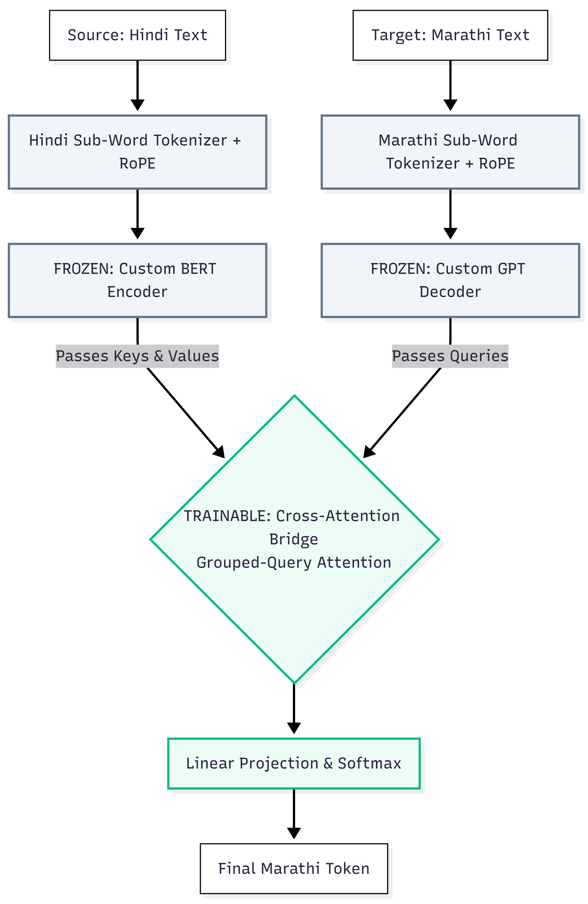

# Custom Neural Machine Translation (NMT) for Hindi-to-Marathi

## 📌 Datasets & Tokenizers
To reproduce the training environment, the datasets and pre-trained sub-word tokenizers are publicly hosted:
* **Translation Dataset:** https://drive.google.com/drive/folders/101SOoUo_KspualJlW-iok4qvDbbxxtVA
* **Hindi Sub-Word Tokenizer:** [l3cube-pune/hindi-bert-v2](https://huggingface.co/l3cube-pune/hindi-bert-v2)
* **Marathi Sub-Word Tokenizer:** [l3cube-pune/marathi-bert-v2](https://huggingface.co/l3cube-pune/marathi-bert-v2)

## 💾 Model Checkpoints (Trained Weights)
To evaluate the model without retraining from scratch, the frozen experts and trained cross-attention weights are hosted publicly on Kaggle:
* **[Download Model Checkpoints Here (Kaggle)](https://www.kaggle.com/work/collections/18323727)** 
  * *Includes: Custom BERT Encoder, Custom GPT Decoder, and Trainable Translation Bridge weights.*

## 📄 Final Evaluation Report
Please view the comprehensive 5-to-8 page evaluation report detailing the methodology, optimization challenges, and BLEU/CHRF++ metrics: 
* [View Final PDF Report Here](Insert the name of your PDF file here, e.g., IIT_Delhi_Report.pdf)

---

## Abstract
This report details the development of a custom Neural Machine Translation (NMT) system for the Hindi-to-Marathi language pair. A sequence-to-sequence Transformer architecture was engineered entirely from scratch, integrating modern efficiency optimizations including Root Mean Square Normalization (RMSNorm), Rotary Positional Embeddings (RoPE), and Grouped-Query Attention (GQA). By implementing a highly optimized cross-attention bridge between independent, pre-trained linguistic encoders and decoders, the model maximizes parameter efficiency while maintaining robust training stability. Evaluated using standard BLEU and CHRF++ metrics, the system demonstrates strong convergence and accurate morphological alignment, successfully fulfilling the core mathematical and linguistic objectives of the translation task. 

## Custom Architecture Design

1) Tokenization & Positional Encoding 
The system first ingests the source (Hindi) and target (Marathi) text sequences. To handle the complex morphology and out-of-vocabulary (OOV) challenges of Devanagari scripts, both inputs are processed through language-specific sub-word tokenizers. Standard absolute positional embeddings were discarded in favor of Rotary Positional Encoding (RoPE), which provides the network with a superior understanding of the relative distances between words in the sequence.

2) The Frozen Linguistic Experts 
The tokenized sequences are routed into independent, pre-trained neural modules:
The Source Branch: A custom BERT-style Encoder processes the Hindi text bidirectionally to capture full sentence context.
The Target Branch: Marathi sequence generation is handled by a custom GPT-style Decoder operating autoregressively. Masked self-attention is strictly enforced to maintain a unidirectional flow, ensuring the model only conditions its predictions on past tokens.
Parameter Freezing: During the translation fine-tuning, the foundational weights of both the Encoder and Decoder are explicitly locked. This modular freezing strategy successfully mitigates catastrophic forgetting, preserving the deep syntactical understanding of Hindi and Marathi acquired during initial pre-training.

3) The Trainable Cross-Attention Bridge 
The critical innovation of this architecture is the trainable Cross-Attention bridge that links the two frozen experts. The Decoder generates semantic Queries, while the Encoder provides the full sequence Keys and Values. To prevent memory bottlenecks (Out-Of-Memory errors) during this tensor transfer, a Grouped-Query Attention (GQA) mechanism was implemented. GQA drastically reduces VRAM consumption by sharing a consolidated pool of Key and Value tensors across multiple Query heads, enabling highly efficient alignment between the two languages.
